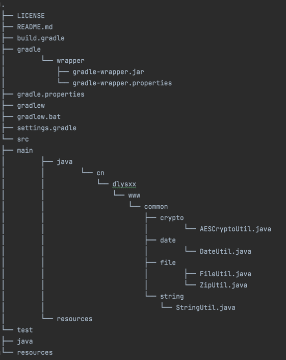

# dlysxx-common
Common utils project

## 
This project summarizes common used util tool classes.

```
<dependency>
  <groupId>cn.dlysxx.www.common</groupId>
  <artifactId>dlysxx-common</artifactId>
  <version>1.0.0</version>
</dependency>
```

## Project structure


* AESCryptoUtil.java
  - encryptString
  - decryptString
  - encryptFile
  - decryptFile
* DateUtil.java
  - nowZonedDateTime
  - nowLocalDateTime
  - nowLocalDate
  - nowLocalTime
  - nowDate
  - nowCalendar
  - nowYearMonth
  - nowString
  - toZonedDateTime
  - toLocalDateTime
  - toLocalDate
  - toLocalTime
  - toDate
  - toCalendar
  - toYearMonth
  - toString
  - isIntime
* FileUtil.java
  - inputStreamToFile
* ZipUtil.java
  - compressToZip
  - decompressFromZip
* StringUtil.java
  - conversion
  - mask
